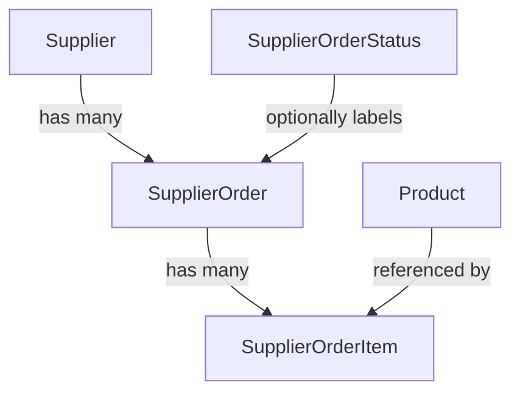
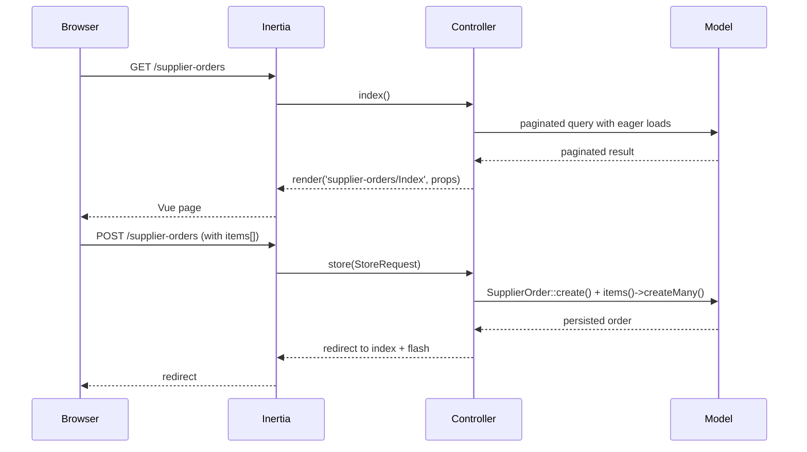

# Design Document: Supplier Orders

## Overview

This feature adds supplier order management to the product sourcing system. It introduces three new entities — `SupplierOrderStatus`, `SupplierOrder`, and `SupplierOrderItem` — that are fully independent from `SupplierProductOffer`. A `SupplierOrder` records a confirmed purchase from a supplier, with line items capturing the exact products, quantities, and confirmed unit costs. Statuses are user-managed labels (e.g. Draft, Confirmed, Shipped) that can be freely created and deleted without affecting order data integrity.

The feature follows the existing Laravel/Inertia/Vue 3 patterns in the codebase: RESTful controllers, Form Requests, Eloquent models with `$fillable` + `casts()`, Inertia page components, TanStack Vue Table for listings, and Wayfinder for type-safe route helpers.

Status management has no dedicated pages. Instead, a "Manage Statuses" button on the supplier orders index opens a Reka UI drawer. The drawer lists all statuses, allows creating a new one, and lets the user edit any existing status inline — all without leaving the orders index.

---

## Architecture

The feature is split into two independent resource groups:

1. **SupplierOrderStatus** — CRUD via API routes only (no dedicated pages). The UI is a drawer component embedded in the supplier orders index page.
2. **SupplierOrder + SupplierOrderItems** — the main order resource. Items are managed as a nested collection on the order's create/edit forms. A dedicated `show` route renders the order detail view with computed totals.

Both groups are protected by the `auth` middleware. All mutations go through Form Requests. Computed values (line total, order total) are never stored — they are calculated at query time or in the frontend.



### Request / Response Flow



---

## Components and Interfaces

### Backend

#### Controllers

| Controller | Route prefix | Notes |
|---|---|---|
| `SupplierOrderStatusController` | `/supplier-order-statuses` | `index`, `store`, `update`, `destroy` only (no pages) |
| `SupplierOrderController` | `/supplier-orders` | Full resource including `show` |

`SupplierOrderController::index()` returns a paginated, sortable collection with eager-loaded `supplier`, `status`, and item count. It also passes all `SupplierOrderStatus` records as a prop so the drawer can render them without a separate request. The list shows: order number, supplier name, status, tracking, ordered/shipped/arrived dates, item count, and creation date.

`SupplierOrderController::show()` returns the order with all items eager-loaded (including `product`), plus computed line totals and order total passed as props.

`SupplierOrderController::store()` and `update()` accept a nested `items[]` array and sync items inside a database transaction.

`SupplierOrderStatusController` handles JSON-style responses for `store`, `update`, and `destroy` — these are called via Inertia from the drawer and redirect back to the orders index with a flash message.

#### Form Requests

```
app/Http/Requests/SupplierOrders/
    StoreRequest.php
    UpdateRequest.php

app/Http/Requests/SupplierOrderStatuses/
    StoreRequest.php
    UpdateRequest.php
```

#### Routes (`routes/web.php` additions)

```php
Route::middleware(['auth'])->group(function () {
    // Status routes — no create/edit/show pages
    Route::resource('supplier-order-statuses', SupplierOrderStatusController::class)
        ->only(['index', 'store', 'update', 'destroy']);

    Route::resource('supplier-orders', SupplierOrderController::class);
});
```

### Frontend

#### Pages

```
resources/js/pages/supplier-orders/
    Index.vue    — order list + "Manage Statuses" button + StatusDrawer
    Create.vue
    Edit.vue
    Show.vue
```

No pages are created for `supplier-order-statuses`. Status management is handled entirely within the drawer component.

#### Components

```
resources/js/pages/supplier-orders/
    StatusDrawer.vue   — drawer with status list, create form, and inline edit form
```

The `StatusDrawer` component:
- Is opened by a "Manage Statuses" button in the `Index.vue` header
- Lists all statuses passed as a prop from the index controller
- Has an inline form to create a new status (name + description)
- Each status row has an edit button that switches that row into an inline edit form within the same drawer
- Submits create/update/delete via Inertia form posts to the `supplier-order-statuses` routes
- On success, Inertia reloads the page props (statuses list refreshes) and the drawer stays open

#### Feature Types

```
resources/js/features/supplier-order-statuses/types/
    supplierOrderStatuses.ts   — SupplierOrderStatus interface

resources/js/features/supplier-orders/types/
    supplierOrders.ts          — SupplierOrder, SupplierOrderItem interfaces
    columns.ts                 — TanStack column definitions for index
```

Both type files are re-exported from `resources/js/types/index.ts`.

#### Wayfinder

After adding routes, run `composer run wayfinder:generate` to regenerate:
- `resources/js/routes/supplier-order-statuses.ts`
- `resources/js/routes/supplier-orders.ts`
- `resources/js/actions/App/Http/Controllers/SupplierOrderStatusController.ts`
- `resources/js/actions/App/Http/Controllers/SupplierOrderController.ts`

Note: `supplier-order-statuses` Wayfinder helpers are used inside `StatusDrawer.vue` for form action URLs.

---

## Data Models

### Existing Migrations (already created)

**`supplier_order_statuses`** (`2026_03_22_205839`):
```
id                  bigint unsigned PK
name                varchar(150) UNIQUE NOT NULL
description         text NULL
created_at / updated_at
```

**`supplier_orders`** (`2026_03_22_210126`):
```
id                  bigint unsigned PK
order_number        varchar UNIQUE NOT NULL
supplier_id         FK → suppliers.id  CASCADE DELETE
status_id           FK → supplier_orders_statuses.id  SET NULL on delete  (nullable)
tracking            varchar(1000) NULL
ordered_at          date NULL
shipped_at          date NULL
arrived_at          date NOT NULL
created_at / updated_at
```

> Note: the statuses table is named `supplier_orders_statuses` (with an extra `s` before `_statuses`). This is the actual table name used in the migration and must be used consistently across models, routes, and controllers.

### New Migration Required

**`supplier_order_items`** (to be created):
```
id                  bigint unsigned PK
supplier_order_id   FK → supplier_orders.id  CASCADE DELETE
product_id          FK → products.id  RESTRICT (no delete if referenced)
quantity            unsignedInteger NOT NULL  (≥ 1)
unit_cost           decimal(10,2) NOT NULL    (≥ 0)
created_at / updated_at
```

### Eloquent Models

#### `SupplierOrderStatus`

```php
// app/Models/SupplierOrderStatus.php
protected $fillable = ['name', 'description'];

public function orders(): HasMany
{
    return $this->hasMany(SupplierOrder::class, 'status_id');
}
```

No `casts()` needed beyond defaults.

#### `SupplierOrder`

```php
// app/Models/SupplierOrder.php
protected $fillable = ['order_number', 'supplier_id', 'status_id', 'tracking', 'ordered_at', 'shipped_at', 'arrived_at'];

protected function casts(): array
{
    return [
        'supplier_id' => 'integer',
        'status_id'   => 'integer',
        'ordered_at'  => 'date',
        'shipped_at'  => 'date',
        'arrived_at'  => 'date',
    ];
}

public function supplier(): BelongsTo
{
    return $this->belongsTo(Supplier::class);
}

public function status(): BelongsTo
{
    return $this->belongsTo(SupplierOrderStatus::class, 'status_id');
}

public function items(): HasMany
{
    return $this->hasMany(SupplierOrderItem::class);
}
```

#### `SupplierOrderItem`

```php
// app/Models/SupplierOrderItem.php
protected $fillable = ['supplier_order_id', 'product_id', 'quantity', 'unit_cost'];

protected function casts(): array
{
    return [
        'quantity'  => 'integer',
        'unit_cost' => 'decimal:2',
    ];
}

public function order(): BelongsTo
{
    return $this->belongsTo(SupplierOrder::class, 'supplier_order_id');
}

public function product(): BelongsTo
{
    return $this->belongsTo(Product::class);
}
```

### Computed Values

Line total and order total are **never stored**. They are computed:

- **Line total**: `quantity × unit_cost` — computed in the frontend from item props, or via a model accessor for convenience in tests.
- **Order total**: sum of all line totals — computed in the frontend by reducing the items array.

For the `show` controller action, the backend can pass pre-computed totals as props to avoid floating-point logic duplication in the frontend:

```php
'order_total' => $order->items->sum(fn($item) => $item->quantity * $item->unit_cost),
```

### TypeScript Interfaces

```typescript
// resources/js/features/supplier-order-statuses/types/supplierOrderStatuses.ts
export interface SupplierOrderStatus {
    id: number;
    name: string;
    description: string | null;
    created_at: string;
    updated_at: string;
}

// resources/js/features/supplier-orders/types/supplierOrders.ts
import type { Supplier } from '@/types';
import type { SupplierOrderStatus } from '@/features/supplier-order-statuses/types/supplierOrderStatuses';

export interface SupplierOrderItem {
    id: number;
    supplier_order_id: number;
    product_id: number;
    quantity: number;
    unit_cost: number | string;
    product?: { id: number; name: string; sku: string | null } | null;
}

export interface SupplierOrder {
    id: number;
    order_number: string;
    supplier_id: number;
    status_id: number | null;
    tracking: string | null;
    ordered_at: string | null;
    shipped_at: string | null;
    arrived_at: string;
    created_at: string;
    updated_at: string;
    supplier?: Supplier | null;
    status?: SupplierOrderStatus | null;
    items?: SupplierOrderItem[];
    items_count?: number;
}
```

### i18n Keys

New keys to add to both `lang/en.json` and `lang/es.json`:

| Key | EN | ES |
|---|---|---|
| `supplier_orders.title` | `Supplier Orders` | `Órdenes de Proveedor` |
| `supplier_orders.description` | `Manage supplier purchase orders` | `Gestionar órdenes de compra a proveedores` |
| `supplier_order_statuses.title` | `Supplier Order Statuses` | `Estados de Orden de Proveedor` |
| `supplier_order_statuses.description` | `Manage order lifecycle statuses` | `Gestionar estados del ciclo de vida de órdenes` |
| `supplier_orders.fields.order_number` | `Order Number` | `Número de Orden` |
| `supplier_orders.fields.supplier` | `Supplier` | `Proveedor` |
| `supplier_orders.fields.status` | `Status` | `Estado` |
| `supplier_orders.fields.tracking` | `Tracking` | `Seguimiento` |
| `supplier_orders.fields.ordered_at` | `Ordered At` | `Fecha de Orden` |
| `supplier_orders.fields.shipped_at` | `Shipped At` | `Fecha de Envío` |
| `supplier_orders.fields.arrived_at` | `Arrived At` | `Fecha de Llegada` |
| `supplier_orders.fields.items` | `Items` | `Artículos` |
| `supplier_orders.fields.unit_cost` | `Unit Cost` | `Costo Unitario` |
| `supplier_orders.fields.quantity` | `Quantity` | `Cantidad` |
| `supplier_orders.fields.line_total` | `Line Total` | `Total de Línea` |
| `supplier_orders.fields.order_total` | `Order Total` | `Total de Orden` |
| `supplier_orders.no_status` | `—` | `—` |


---

## Correctness Properties

*A property is a characteristic or behavior that should hold true across all valid executions of a system — essentially, a formal statement about what the system should do. Properties serve as the bridge between human-readable specifications and machine-verifiable correctness guarantees.*

### Property 1: Status name uniqueness

*For any* two `SupplierOrderStatus` creation requests that share the same `name` value, the second request should be rejected with a validation error and no duplicate record should be created.

**Validates: Requirements 1.2**

---

### Property 2: Status deletion nullifies order references

*For any* `SupplierOrderStatus` that is assigned to one or more `SupplierOrder` records, deleting that status should leave all previously-assigned orders intact with their `status_id` set to `null`.

**Validates: Requirements 1.3**

---

### Property 3: Order store requires a valid supplier

*For any* store request with a `supplier_id` that does not correspond to an existing `Supplier`, the system should return a validation error and no order should be created. Conversely, for any valid `supplier_id`, the created order should be associated with that supplier.

**Validates: Requirements 2.1, 2.2, 2.3**

---

### Property 4: Order store rejects invalid status reference

*For any* store request that includes a `status_id` value that does not correspond to an existing `SupplierOrderStatus`, the system should return a validation error and no order should be created.

**Validates: Requirements 2.4**

---

### Property 5: Item constraints are enforced

*For any* `SupplierOrderItem` payload, a `quantity` less than 1 or a `unit_cost` less than 0 should be rejected with a validation error, and no item should be persisted. Valid payloads (quantity ≥ 1, unit_cost ≥ 0) should be accepted and persisted.

**Validates: Requirements 3.1, 3.3, 3.4**

---

### Property 6: Item references a valid product

*For any* `SupplierOrderItem` payload with a `product_id` that does not correspond to an existing `Product`, the system should return a validation error and no item should be persisted.

**Validates: Requirements 3.2**

---

### Property 7: Order update syncs item collection

*For any* existing `SupplierOrder` and any new set of valid items submitted via an update request, the order's item collection after the update should exactly match the submitted items (no stale items remain, all new items are present).

**Validates: Requirements 3.5**

---

### Property 8: Order deletion cascades to items

*For any* `SupplierOrder` that has one or more associated `SupplierOrderItem` records, deleting the order should also delete all of its items, leaving no orphaned item records in the database.

**Validates: Requirements 3.6, 6.1**

---

### Property 9: Line total computation

*For any* `SupplierOrderItem` with a given `quantity` and `unit_cost`, the computed line total should equal `quantity × unit_cost`.

**Validates: Requirements 4.2**

---

### Property 10: Order total computation

*For any* `SupplierOrder` with a set of items, the computed order total should equal the sum of all individual line totals (`Σ quantity_i × unit_cost_i`).

**Validates: Requirements 4.3**

---

### Property 11: All routes require authentication

*For any* route belonging to `supplier-orders` or `supplier-order-statuses`, an unauthenticated HTTP request should receive a redirect to the login page rather than a successful response.

**Validates: Requirements 7.1, 7.2**

---

## Error Handling

### Validation Errors

All validation is handled by Laravel Form Requests. Inertia automatically surfaces field-level errors to the Vue frontend via the `errors` prop. No custom error handling is needed beyond standard Form Request responses.

Key validation rules:

| Field | Rule |
|---|---|
| `SupplierOrderStatus.name` | required, string, max:150, unique:supplier_orders_statuses |
| `SupplierOrder.order_number` | required, string, unique:supplier_orders |
| `SupplierOrder.supplier_id` | required, integer, exists:suppliers,id |
| `SupplierOrder.status_id` | nullable, integer, exists:supplier_orders_statuses,id |
| `SupplierOrder.tracking` | nullable, string, max:1000 |
| `SupplierOrder.ordered_at` | nullable, date |
| `SupplierOrder.shipped_at` | nullable, date |
| `SupplierOrder.arrived_at` | required, date |
| `SupplierOrderItem.product_id` | required, integer, exists:products,id |
| `SupplierOrderItem.quantity` | required, integer, min:1 |
| `SupplierOrderItem.unit_cost` | required, decimal:0,2, min:0 |

### Referential Integrity

- Deleting a `SupplierOrderStatus` → `SET NULL` on `supplier_orders.status_id` (handled by DB constraint).
- Deleting a `SupplierOrder` → `CASCADE DELETE` on `supplier_order_items` (handled by DB constraint).
- Deleting a `Supplier` → `CASCADE DELETE` on `supplier_orders` (existing constraint, already in migration).
- Deleting a `Product` that is referenced by items → should be `RESTRICT` to prevent orphaned items. The migration for `supplier_order_items` should use `->restrictOnDelete()` on the `product_id` FK.

### Null Status Display

When `status_id` is `null`, the frontend should display `"—"` (em dash). The TypeScript type for `status` is `SupplierOrderStatus | null`, so the template must guard against null before accessing `status.name`.

### Transaction Safety

The `store` and `update` actions on `SupplierOrderController` must wrap order creation/update and item sync inside a `DB::transaction()` to ensure atomicity. If item creation fails after the order is created, the entire operation rolls back.

---

## Testing Strategy

### Dual Testing Approach

Both unit/feature tests and property-based tests are used. They are complementary:

- **Feature tests (Pest)**: verify specific HTTP behaviors, redirects, auth enforcement, and persistence side effects.
- **Property-based tests (Pest + `pestphp/pest-plugin-arch` is not PBT — use `eris/eris` or inline data providers)**: verify universal properties across many generated inputs.

Since the project uses Pest 4.4 and there is no PBT library currently installed, property-based tests will be implemented using **Pest's `dataset` feature with generated data** (via PHP's `fake()` / Faker) combined with loops to approximate property testing. Each "property test" runs the assertion across a range of generated inputs (minimum 100 iterations where applicable).

The recommended PBT library to add is **`giorgiosironi/eris`** (PHP property-based testing). Alternatively, Pest datasets with Faker-generated inputs provide a pragmatic approximation without adding a new dependency.

### Feature Tests (Pest)

Location: `tests/Feature/SupplierOrders/` and `tests/Feature/SupplierOrderStatuses/`

**SupplierOrderStatus tests:**
- `test('guests are redirected from status routes')` — covers Property 11 (index, store, update, destroy)
- `test('authenticated user can create a status')` — covers 1.1
- `test('duplicate status name is rejected')` — covers Property 1
- `test('deleting a status nullifies order status_id')` — covers Property 2
- `test('status index returns all statuses')` — covers 1.4

**SupplierOrder tests:**
- `test('guests are redirected from order routes')` — covers Property 11
- `test('order requires valid supplier_id')` — covers Property 3
- `test('order rejects invalid status_id')` — covers Property 4
- `test('order items are validated')` — covers Properties 5 and 6 (edge cases: quantity=0, unit_cost=-1, bad product_id)
- `test('order store persists order and items in transaction')` — covers 2.1, 3.1
- `test('order update syncs items')` — covers Property 7
- `test('deleting order cascades to items')` — covers Property 8
- `test('order index returns expected shape')` — covers 4.1 (example)
- `test('order show returns items with line totals')` — covers Properties 9 and 10
- `test('null status displays without error')` — covers 4.4 (edge case)
- `test('delete redirects to index with success')` — covers 6.2 (example)

### Property-Based Tests

Each property test uses Faker to generate varied inputs and runs assertions across multiple generated cases. Tag format: `Feature: supplier-orders, Property N: <text>`.

```php
// Feature: supplier-orders, Property 9: Line total computation
test('line total equals quantity times unit_cost', function () {
    for ($i = 0; $i < 100; $i++) {
        $quantity = fake()->numberBetween(1, 1000);
        $unitCost = fake()->randomFloat(2, 0, 9999.99);
        $lineTotal = $quantity * $unitCost;
        expect(round($lineTotal, 2))->toBe(round($quantity * $unitCost, 2));
    }
});

// Feature: supplier-orders, Property 10: Order total computation
test('order total equals sum of line totals', function () {
    for ($i = 0; $i < 100; $i++) {
        $items = collect(range(1, fake()->numberBetween(1, 10)))->map(fn() => [
            'quantity'  => fake()->numberBetween(1, 100),
            'unit_cost' => fake()->randomFloat(2, 0, 999.99),
        ]);
        $expected = $items->sum(fn($item) => $item['quantity'] * $item['unit_cost']);
        $actual   = $items->sum(fn($item) => $item['quantity'] * $item['unit_cost']);
        expect(round($actual, 2))->toBe(round($expected, 2));
    }
});
```

For database-backed properties (Properties 1–8, 11), Pest feature tests with `RefreshDatabase` and Faker-generated inputs cover the property across varied data.

### Test Configuration

- All feature tests use `RefreshDatabase` (configured in `tests/Pest.php`).
- DB is SQLite in-memory (`phpunit.xml`).
- Each property test runs minimum 100 iterations.
- Tests are tagged with comments referencing the design property number.
