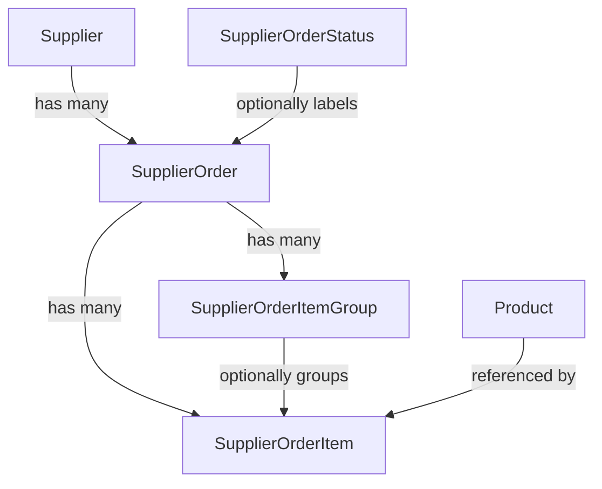
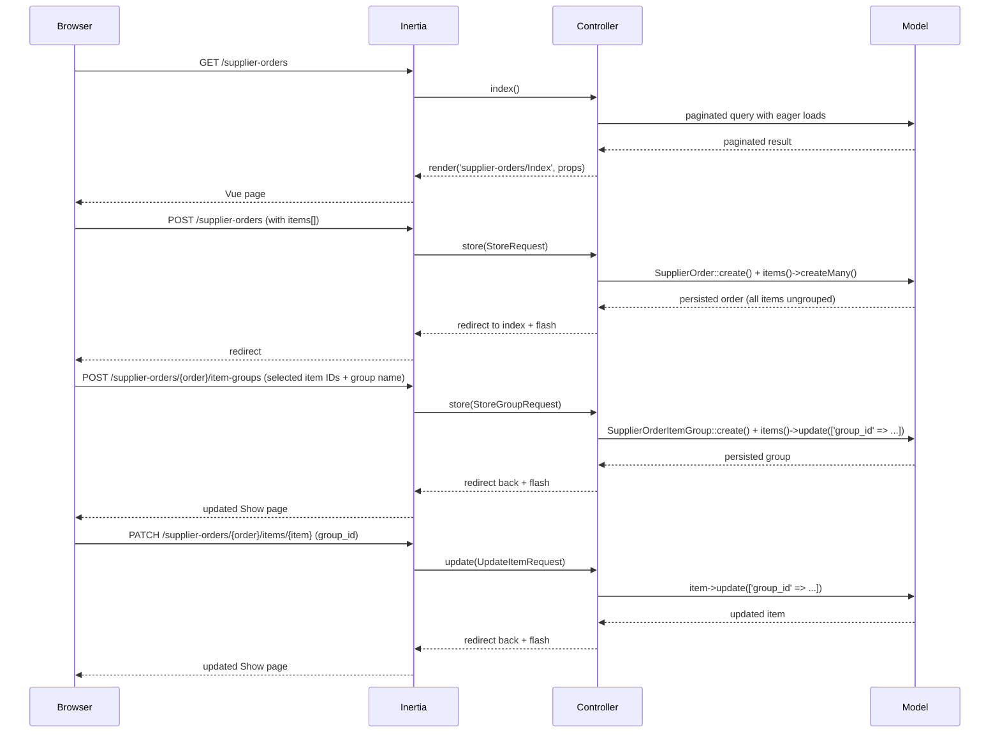

# Design Document: Supplier Orders

## Overview

This feature adds supplier order management to the product sourcing system. It introduces four new entities — `SupplierOrderStatus`, `SupplierOrder`, `SupplierOrderItem`, and `SupplierOrderItemGroup` — that are fully independent from `SupplierProductOffer`.

A `SupplierOrder` records a confirmed purchase from a supplier. Line items are always added to a flat, ungrouped list first. The user can then select items from that ungrouped list and create a named `SupplierOrderItemGroup` to organize them. Once grouped, items leave the ungrouped list and appear only within their group's own item list on the order detail view. Items can be moved between groups or returned to the ungrouped list at any time. Statuses are user-managed labels (e.g. Draft, Confirmed, Shipped) that can be freely created and deleted without affecting order data integrity.

The feature follows the existing Laravel/Inertia/Vue 3 patterns in the codebase: RESTful controllers, Form Requests, Eloquent models with `$fillable` + `casts()`, Inertia page components, TanStack Vue Table for listings, and Wayfinder for type-safe route helpers.

Status management has no dedicated pages. Instead, a "Manage Statuses" button on the supplier orders index opens a Reka UI drawer. The drawer lists all statuses, allows creating a new one, and lets the user edit any existing status inline — all without leaving the orders index.

---

## Architecture

The feature is split into three independent resource groups:

1. **SupplierOrderStatus** — CRUD via API routes only (no dedicated pages). The UI is a drawer component embedded in the supplier orders index page.
2. **SupplierOrder + SupplierOrderItems** — the main order resource. Items are managed as a nested collection on the order's create/edit forms. A dedicated `show` route renders the order detail view with two distinct sections: the ungrouped items list and the groups section (each group with its own item list).
3. **SupplierOrderItemGroup** — group management scoped to a specific order. Groups are created from the order detail view by selecting items. Items can be moved between groups or ungrouped from the same view.

All groups are protected by the `auth` middleware. All mutations go through Form Requests. Computed values (line total, order total) are never stored — they are calculated at query time or in the frontend.



### Request / Response Flow



---

## Components and Interfaces

### Backend

#### Controllers

| Controller | Route prefix | Notes |
|---|---|---|
| `SupplierOrderStatusController` | `/supplier-order-statuses` | `index`, `store`, `update`, `destroy` only (no pages) |
| `SupplierOrderController` | `/supplier-orders` | Full resource including `show` |
| `SupplierOrderItemGroupController` | `/supplier-orders/{supplierOrder}/item-groups` | Nested under order; `store`, `update`, `destroy` |
| `SupplierOrderItemController` | `/supplier-orders/{supplierOrder}/items` | Nested under order; `store`, `update`, `destroy` for individual item management including group assignment |

`SupplierOrderController::index()` returns a paginated, sortable collection with eager-loaded `supplier`, `status`, and item count. It also passes all `SupplierOrderStatus` records as a prop so the drawer can render them without a separate request.

`SupplierOrderController::show()` returns the order with all items eager-loaded (including `product` and `group`), all groups for the order (each with their items), plus computed line totals and order total passed as props. The frontend renders two separate sections: ungrouped items (where `group_id` is null) and groups (each rendered with their own item list).

`SupplierOrderController::store()` and `update()` accept a nested `items[]` array and sync items inside a database transaction. All items are created without a `group_id` (ungrouped).

`SupplierOrderItemGroupController::store()` accepts a `name` and an array of `item_ids` (all must belong to the same order). It creates the group and assigns the selected items to it in a transaction.

`SupplierOrderItemGroupController::update()` accepts a `name` to rename the group.

`SupplierOrderItemGroupController::destroy()` deletes the group and sets `group_id = null` on all its items (ungrouping them).

`SupplierOrderItemController::update()` accepts a `group_id` (nullable) to move an item to a different group or back to ungrouped.

#### Form Requests

```
app/Http/Requests/SupplierOrders/
    StoreRequest.php
    UpdateRequest.php

app/Http/Requests/SupplierOrderStatuses/
    StoreRequest.php
    UpdateRequest.php

app/Http/Requests/SupplierOrderItemGroups/
    StoreRequest.php
    UpdateRequest.php

app/Http/Requests/SupplierOrderItems/
    UpdateRequest.php   (for group assignment only)
```

#### Routes (`routes/web.php` additions)

```php
Route::middleware(['auth'])->group(function () {
    // Status routes — no create/edit/show pages
    Route::resource('supplier-order-statuses', SupplierOrderStatusController::class)
        ->only(['index', 'store', 'update', 'destroy']);

    Route::resource('supplier-orders', SupplierOrderController::class);

    // Nested routes scoped to a specific order
    Route::resource('supplier-orders.item-groups', SupplierOrderItemGroupController::class)
        ->only(['store', 'update', 'destroy'])
        ->scoped();

    Route::resource('supplier-orders.items', SupplierOrderItemController::class)
        ->only(['store', 'update', 'destroy'])
        ->scoped();
});
```

### Frontend

#### Pages

```
resources/js/pages/supplier-orders/
    Index.vue    — order list + "Manage Statuses" button + StatusDrawer
    Create.vue
    Edit.vue
    Show.vue     — unified item list with group labels + group management panel
```

No pages are created for `supplier-order-statuses` or `supplier-order-item-groups`. Status management is handled entirely within the drawer component. Group management is handled inline on the `Show.vue` page.

#### Components

```
resources/js/pages/supplier-orders/
    StatusDrawer.vue        — drawer with status list, create form, and inline edit form

resources/js/features/supplier-orders/components/
    SupplierOrderDataTableDropdown.vue   — row actions for the orders index table
    ItemGroupPanel.vue                   — panel on Show.vue listing groups, with rename/delete actions
    ItemGroupAssignDropdown.vue          — dropdown on each item row to move it to a group or ungroup it
```

The `Show.vue` page renders two distinct sections:
1. **Ungrouped items list** — a table of items where `group_id` is null. Rows have checkboxes for selection. When ≥ 1 item is selected, a "Create Group" button appears to group the selection.
2. **Groups section** — one collapsible block per group, each containing its own item table. Each group block has a header with the group name, rename and delete actions, and an `ItemGroupAssignDropdown` per item row to move items to another group or back to ungrouped.

#### Feature Types

```
resources/js/features/supplier-order-statuses/types/
    supplierOrderStatuses.ts   — SupplierOrderStatus interface

resources/js/features/supplier-orders/types/
    supplierOrders.ts          — SupplierOrder, SupplierOrderItem, SupplierOrderItemGroup interfaces
    columns.ts                 — TanStack column definitions for index
```

Both type files are re-exported from `resources/js/types/index.ts`.

#### Wayfinder

After adding routes, run `composer run wayfinder:generate` to regenerate:
- `resources/js/routes/supplier-order-statuses.ts`
- `resources/js/routes/supplier-orders.ts`
- `resources/js/actions/App/Http/Controllers/SupplierOrderStatusController.ts`
- `resources/js/actions/App/Http/Controllers/SupplierOrderController.ts`
- `resources/js/actions/App/Http/Controllers/SupplierOrderItemGroupController.ts`
- `resources/js/actions/App/Http/Controllers/SupplierOrderItemController.ts`

---

## Data Models

### Existing Migrations (already created)

**`supplier_order_statuses`** (`2026_03_22_205839`):
```
id                  bigint unsigned PK
name                varchar(150) UNIQUE NOT NULL
description         text NULL
created_at / updated_at
```

**`supplier_orders`** (`2026_03_22_210126`):
```
id                  bigint unsigned PK
order_number        varchar UNIQUE NOT NULL
supplier_id         FK → suppliers.id  CASCADE DELETE
status_id           FK → supplier_order_statuses.id  SET NULL on delete  (nullable)
tracking            varchar(1000) NULL
ordered_at          date NULL
shipped_at          date NULL
arrived_at          date NOT NULL
created_at / updated_at
```

### New Migrations Required

**`supplier_order_item_groups`** (to be created):
```
id                  bigint unsigned PK
supplier_order_id   FK → supplier_orders.id  CASCADE DELETE
name                varchar(150) NOT NULL
created_at / updated_at
```

**`supplier_order_items`** (to be created / corrected):
```
id                  bigint unsigned PK
supplier_order_id   FK → supplier_orders.id  CASCADE DELETE
group_id            FK → supplier_order_item_groups.id  SET NULL on delete  (nullable)
product_id          FK → products.id  RESTRICT (no delete if referenced)
quantity            unsignedInteger NOT NULL  (≥ 1)
unit_cost           decimal(10,2) NOT NULL    (≥ 0)
created_at / updated_at
```

> Note: `group_id` is nullable. A null `group_id` means the item is ungrouped. The `supplier_order_item_groups` migration must run before `supplier_order_items` so the FK can be established.

### Eloquent Models

#### `SupplierOrderStatus`

```php
// app/Models/SupplierOrderStatus.php
protected $fillable = ['name', 'description'];

public function orders(): HasMany
{
    return $this->hasMany(SupplierOrder::class, 'status_id');
}
```

#### `SupplierOrder`

```php
// app/Models/SupplierOrder.php
protected $fillable = ['order_number', 'supplier_id', 'status_id', 'tracking', 'ordered_at', 'shipped_at', 'arrived_at'];

protected function casts(): array
{
    return [
        'supplier_id' => 'integer',
        'status_id'   => 'integer',
        'ordered_at'  => 'date',
        'shipped_at'  => 'date',
        'arrived_at'  => 'date',
    ];
}

public function supplier(): BelongsTo { ... }
public function status(): BelongsTo { ... }
public function items(): HasMany { ... }
public function groups(): HasMany
{
    return $this->hasMany(SupplierOrderItemGroup::class);
}
```

#### `SupplierOrderItemGroup`

```php
// app/Models/SupplierOrderItemGroup.php
protected $fillable = ['supplier_order_id', 'name'];

public function order(): BelongsTo
{
    return $this->belongsTo(SupplierOrder::class, 'supplier_order_id');
}

public function items(): HasMany
{
    return $this->hasMany(SupplierOrderItem::class, 'group_id');
}
```

#### `SupplierOrderItem`

```php
// app/Models/SupplierOrderItem.php
protected $fillable = ['supplier_order_id', 'product_id', 'group_id', 'quantity', 'unit_cost'];

protected function casts(): array
{
    return [
        'quantity'  => 'integer',
        'unit_cost' => 'decimal:2',
        'group_id'  => 'integer',
    ];
}

public function order(): BelongsTo { ... }
public function product(): BelongsTo { ... }
public function group(): BelongsTo
{
    return $this->belongsTo(SupplierOrderItemGroup::class, 'group_id');
}
```

### Computed Values

Line total and order total are **never stored**. They are computed:

- **Line total**: `quantity × unit_cost` — computed in the frontend from item props.
- **Order total**: sum of all line totals — computed in the frontend by reducing the items array.

For the `show` controller action, the backend passes pre-computed totals as props:

```php
'order_total' => $order->items->sum(fn($item) => $item->quantity * $item->unit_cost),
```

### TypeScript Interfaces

```typescript
// resources/js/features/supplier-order-statuses/types/supplierOrderStatuses.ts
export interface SupplierOrderStatus {
    id: number;
    name: string;
    description: string | null;
    created_at: string;
    updated_at: string;
}

// resources/js/features/supplier-orders/types/supplierOrders.ts
import type { Supplier } from '@/types';
import type { SupplierOrderStatus } from '@/features/supplier-order-statuses/types/supplierOrderStatuses';

export interface SupplierOrderItemGroup {
    id: number;
    supplier_order_id: number;
    name: string;
    created_at: string;
    updated_at: string;
}

export interface SupplierOrderItem {
    id: number;
    supplier_order_id: number;
    product_id: number;
    group_id: number | null;
    quantity: number;
    unit_cost: number | string;
    product?: { id: number; name: string; sku: string | null } | null;
    group?: SupplierOrderItemGroup | null;
}

export interface SupplierOrder {
    id: number;
    order_number: string;
    supplier_id: number;
    status_id: number | null;
    tracking: string | null;
    ordered_at: string | null;
    shipped_at: string | null;
    arrived_at: string;
    created_at: string;
    updated_at: string;
    supplier?: Supplier | null;
    status?: SupplierOrderStatus | null;
    items?: SupplierOrderItem[];
    groups?: SupplierOrderItemGroup[];
    items_count?: number;
}
```

### i18n Keys

New keys to add to both `lang/en.json` and `lang/es.json`:

| Key | EN | ES |
|---|---|---|
| `supplier_orders.title` | `Supplier Orders` | `Órdenes de Proveedor` |
| `supplier_orders.description` | `Manage supplier purchase orders` | `Gestionar órdenes de compra a proveedores` |
| `supplier_order_statuses.title` | `Supplier Order Statuses` | `Estados de Orden de Proveedor` |
| `supplier_order_statuses.description` | `Manage order lifecycle statuses` | `Gestionar estados del ciclo de vida de órdenes` |
| `supplier_orders.fields.order_number` | `Order Number` | `Número de Orden` |
| `supplier_orders.fields.supplier` | `Supplier` | `Proveedor` |
| `supplier_orders.fields.status` | `Status` | `Estado` |
| `supplier_orders.fields.tracking` | `Tracking` | `Seguimiento` |
| `supplier_orders.fields.ordered_at` | `Ordered At` | `Fecha de Orden` |
| `supplier_orders.fields.shipped_at` | `Shipped At` | `Fecha de Envío` |
| `supplier_orders.fields.arrived_at` | `Arrived At` | `Fecha de Llegada` |
| `supplier_orders.fields.items` | `Items` | `Artículos` |
| `supplier_orders.fields.unit_cost` | `Unit Cost` | `Costo Unitario` |
| `supplier_orders.fields.quantity` | `Quantity` | `Cantidad` |
| `supplier_orders.fields.line_total` | `Line Total` | `Total de Línea` |
| `supplier_orders.fields.order_total` | `Order Total` | `Total de Orden` |
| `supplier_orders.fields.group` | `Group` | `Grupo` |
| `supplier_orders.no_status` | `—` | `—` |
| `supplier_orders.no_group` | `—` | `—` |
| `supplier_orders.item_groups.title` | `Item Groups` | `Grupos de Artículos` |
| `supplier_orders.item_groups.create` | `Create Group` | `Crear Grupo` |
| `supplier_orders.item_groups.name` | `Group Name` | `Nombre del Grupo` |
| `supplier_orders.item_groups.ungroup` | `Ungroup` | `Desagrupar` |

---

## Correctness Properties

*A property is a characteristic or behavior that should hold true across all valid executions of a system — essentially, a formal statement about what the system should do.*

### Property 1: Status name uniqueness

*For any* two `SupplierOrderStatus` creation requests that share the same `name` value, the second request should be rejected with a validation error and no duplicate record should be created.

**Validates: Requirements 1.2**

---

### Property 2: Status deletion nullifies order references

*For any* `SupplierOrderStatus` that is assigned to one or more `SupplierOrder` records, deleting that status should leave all previously-assigned orders intact with their `status_id` set to `null`.

**Validates: Requirements 1.3**

---

### Property 3: Order store requires a valid supplier

*For any* store request with a `supplier_id` that does not correspond to an existing `Supplier`, the system should return a validation error and no order should be created. Conversely, for any valid `supplier_id`, the created order should be associated with that supplier.

**Validates: Requirements 2.1, 2.2, 2.3**

---

### Property 4: Order store rejects invalid status reference

*For any* store request that includes a `status_id` value that does not correspond to an existing `SupplierOrderStatus`, the system should return a validation error and no order should be created.

**Validates: Requirements 2.4**

---

### Property 5: Item constraints are enforced

*For any* `SupplierOrderItem` payload, a `quantity` less than 1 or a `unit_cost` less than 0 should be rejected with a validation error, and no item should be persisted. Valid payloads (quantity ≥ 1, unit_cost ≥ 0) should be accepted and persisted.

**Validates: Requirements 3.1, 3.3, 3.4**

---

### Property 6: Item references a valid product

*For any* `SupplierOrderItem` payload with a `product_id` that does not correspond to an existing `Product`, the system should return a validation error and no item should be persisted.

**Validates: Requirements 3.2**

---

### Property 7: New items are always ungrouped

*For any* `SupplierOrderItem` created via the store action, the resulting record should have `group_id = null` regardless of any other payload values.

**Validates: Requirements 3.7**

---

### Property 8: Order update syncs item collection

*For any* existing `SupplierOrder` and any new set of valid items submitted via an update request, the order's item collection after the update should exactly match the submitted items (no stale items remain, all new items are present, all new items are ungrouped).

**Validates: Requirements 3.5**

---

### Property 9: Group creation assigns items and removes them from ungrouped list

*For any* group creation request with a valid `name` and a non-empty list of `item_ids` belonging to the same order, all specified items should have their `group_id` set to the new group's id after the operation, and none of those items should appear in the ungrouped items list.

**Validates: Requirements 4.1, 4.2, 4.3**

---

### Property 10: Group deletion ungroups items and returns them to ungrouped list

*For any* `SupplierOrderItemGroup` that has one or more items, deleting the group should leave all previously-grouped items intact with their `group_id` set to `null`, returning them to the ungrouped items list. No items should be deleted.

**Validates: Requirements 4.7**

---

### Property 11: Item group assignment is mutable

*For any* `SupplierOrderItem`, updating its `group_id` to a valid group id (belonging to the same order) should move it from its current list (ungrouped or source group) to the destination group's list. Setting `group_id` to `null` should return it to the ungrouped list.

**Validates: Requirements 4.5, 4.6**

---

### Property 12: Order deletion cascades to items and groups

*For any* `SupplierOrder` that has associated `SupplierOrderItem` and `SupplierOrderItemGroup` records, deleting the order should also delete all of its items and groups, leaving no orphaned records in the database.

**Validates: Requirements 3.6, 7.1**

---

### Property 13: Line total computation

*For any* `SupplierOrderItem` with a given `quantity` and `unit_cost`, the computed line total should equal `quantity × unit_cost`.

**Validates: Requirements 5.2**

---

### Property 14: Order total computation

*For any* `SupplierOrder` with a set of items, the computed order total should equal the sum of all individual line totals (`Σ quantity_i × unit_cost_i`).

**Validates: Requirements 5.3**

---

### Property 15: All routes require authentication

*For any* route belonging to `supplier-orders`, `supplier-order-statuses`, or the nested item/group routes, an unauthenticated HTTP request should receive a redirect to the login page rather than a successful response.

**Validates: Requirements 8.1, 8.2**

---

## Error Handling

### Validation Errors

All validation is handled by Laravel Form Requests. Inertia automatically surfaces field-level errors to the Vue frontend via the `errors` prop.

Key validation rules:

| Field | Rule |
|---|---|
| `SupplierOrderStatus.name` | required, string, max:150, unique:supplier_order_statuses |
| `SupplierOrder.order_number` | required, string, unique:supplier_orders |
| `SupplierOrder.supplier_id` | required, integer, exists:suppliers,id |
| `SupplierOrder.status_id` | nullable, integer, exists:supplier_order_statuses,id |
| `SupplierOrder.tracking` | nullable, string, max:1000 |
| `SupplierOrder.ordered_at` | nullable, date |
| `SupplierOrder.shipped_at` | nullable, date |
| `SupplierOrder.arrived_at` | required, date |
| `SupplierOrderItem.product_id` | required, integer, exists:products,id |
| `SupplierOrderItem.quantity` | required, integer, min:1 |
| `SupplierOrderItem.unit_cost` | required, decimal:0,2, min:0 |
| `SupplierOrderItemGroup.name` | required, string, max:150 |
| `SupplierOrderItemGroup.item_ids` | required, array, min:1; each item must exist and belong to the same order |
| `SupplierOrderItem.group_id` (update) | nullable, integer, exists:supplier_order_item_groups,id; group must belong to the same order |

### Referential Integrity

- Deleting a `SupplierOrderStatus` → `SET NULL` on `supplier_orders.status_id` (DB constraint).
- Deleting a `SupplierOrder` → `CASCADE DELETE` on `supplier_order_items` and `supplier_order_item_groups` (DB constraint).
- Deleting a `SupplierOrderItemGroup` → `SET NULL` on `supplier_order_items.group_id` (DB constraint).
- Deleting a `Supplier` → `CASCADE DELETE` on `supplier_orders` (existing constraint).
- Deleting a `Product` that is referenced by items → `RESTRICT` to prevent orphaned items.

### Null Status / Group Display

- When `status_id` is `null`, the frontend displays `"—"`.
- When `group_id` is `null`, the frontend displays `"—"` in the group column.
- TypeScript types for both `status` and `group` are nullable, so templates must guard against null before accessing their properties.

### Transaction Safety

- `SupplierOrderController::store()` and `update()` wrap order + item operations in `DB::transaction()`.
- `SupplierOrderItemGroupController::store()` wraps group creation + item assignment in `DB::transaction()`.
- `SupplierOrderItemGroupController::destroy()` wraps group deletion + item ungrouping in `DB::transaction()`.

---

## Testing Strategy

### Dual Testing Approach

Both unit/feature tests and property-based tests are used. They are complementary:

- **Feature tests (Pest)**: verify specific HTTP behaviors, redirects, auth enforcement, and persistence side effects.
- **Property-based tests**: implemented using Pest's `dataset` feature with Faker-generated data and loops to approximate property testing across many inputs.

### Feature Tests (Pest)

Location: `tests/Feature/SupplierOrders/` and `tests/Feature/SupplierOrderStatuses/`

**SupplierOrderStatus tests:**
- `test('guests are redirected from status routes')` — covers Property 15
- `test('authenticated user can create a status')` — covers 1.1
- `test('duplicate status name is rejected')` — covers Property 1
- `test('deleting a status nullifies order status_id')` — covers Property 2
- `test('status index returns all statuses')` — covers 1.4

**SupplierOrder tests:**
- `test('guests are redirected from order routes')` — covers Property 15
- `test('order requires valid supplier_id')` — covers Property 3
- `test('order rejects invalid status_id')` — covers Property 4
- `test('order items are validated')` — covers Properties 5 and 6
- `test('order store persists order and items ungrouped')` — covers 2.1, 3.1, Property 7
- `test('order update syncs items and ungroups them')` — covers Property 8
- `test('deleting order cascades to items and groups')` — covers Property 12
- `test('order index returns expected shape')` — covers 5.1
- `test('order show returns unified item list with group info')` — covers 5.2, Properties 13 and 14
- `test('null status displays without error')` — covers 5.4
- `test('delete redirects to index with success')` — covers 7.2

**SupplierOrderItemGroup tests:**
- `test('guests are redirected from item group routes')` — covers Property 15
- `test('creating a group assigns selected items')` — covers Property 9
- `test('creating a group requires at least one item')` — covers 4.3
- `test('creating a group requires a name')` — covers 4.8
- `test('deleting a group ungroups its items')` — covers Property 10
- `test('renaming a group persists the new name')` — covers 4.7
- `test('moving an item to another group updates group_id')` — covers Property 11
- `test('ungrouping an item sets group_id to null')` — covers Property 11

### Property-Based Tests

Each property test uses Faker to generate varied inputs and runs assertions across multiple generated cases.

```php
// Property 7: New items are always ungrouped
test('new items always have null group_id', function () {
    for ($i = 0; $i < 50; $i++) {
        // create order + item via store, assert group_id is null
    }
});

// Property 13: Line total computation
test('line total equals quantity times unit_cost', function () {
    for ($i = 0; $i < 100; $i++) {
        $quantity = fake()->numberBetween(1, 1000);
        $unitCost = fake()->randomFloat(2, 0, 9999.99);
        expect(round($quantity * $unitCost, 2))->toBe(round($quantity * $unitCost, 2));
    }
});

// Property 14: Order total computation
test('order total equals sum of line totals', function () {
    for ($i = 0; $i < 100; $i++) {
        $items = collect(range(1, fake()->numberBetween(1, 10)))->map(fn() => [
            'quantity'  => fake()->numberBetween(1, 100),
            'unit_cost' => fake()->randomFloat(2, 0, 999.99),
        ]);
        $expected = $items->sum(fn($item) => $item['quantity'] * $item['unit_cost']);
        $actual   = $items->sum(fn($item) => $item['quantity'] * $item['unit_cost']);
        expect(round($actual, 2))->toBe(round($expected, 2));
    }
});
```

### Test Configuration

- All feature tests use `RefreshDatabase` (configured in `tests/Pest.php`).
- DB is SQLite in-memory (`phpunit.xml`).
- Each property test runs minimum 50–100 iterations.
- Tests are tagged with comments referencing the design property number.
